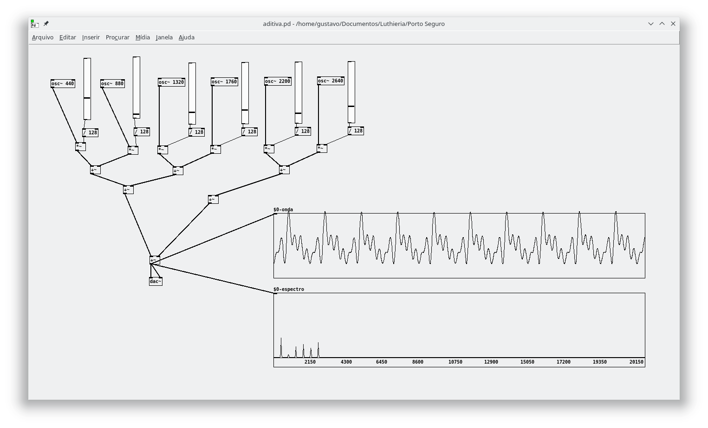
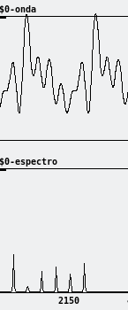
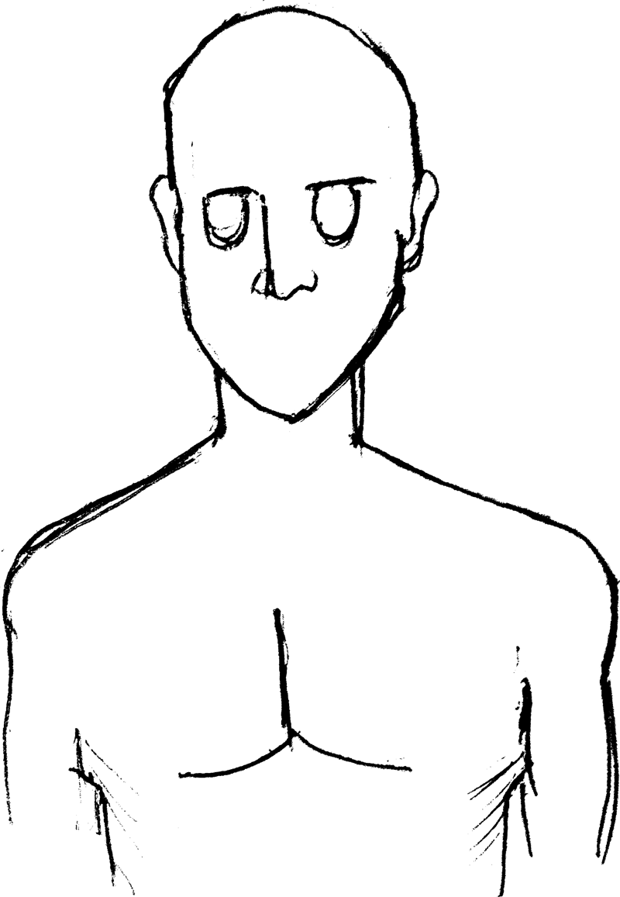
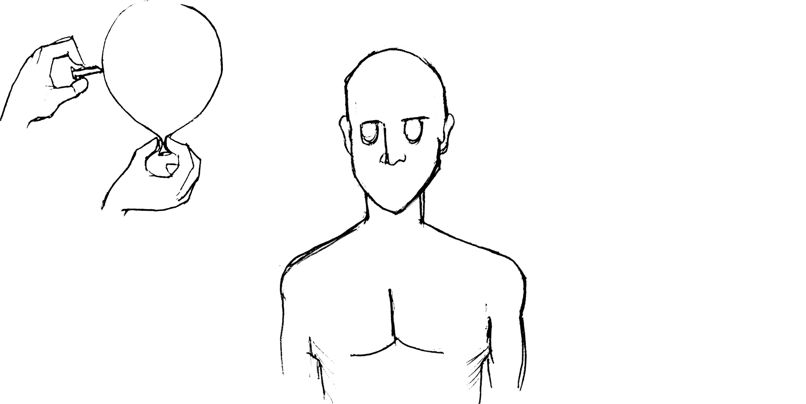
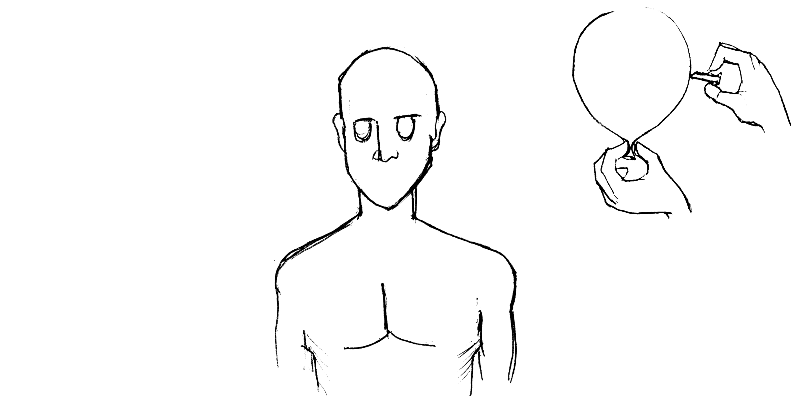
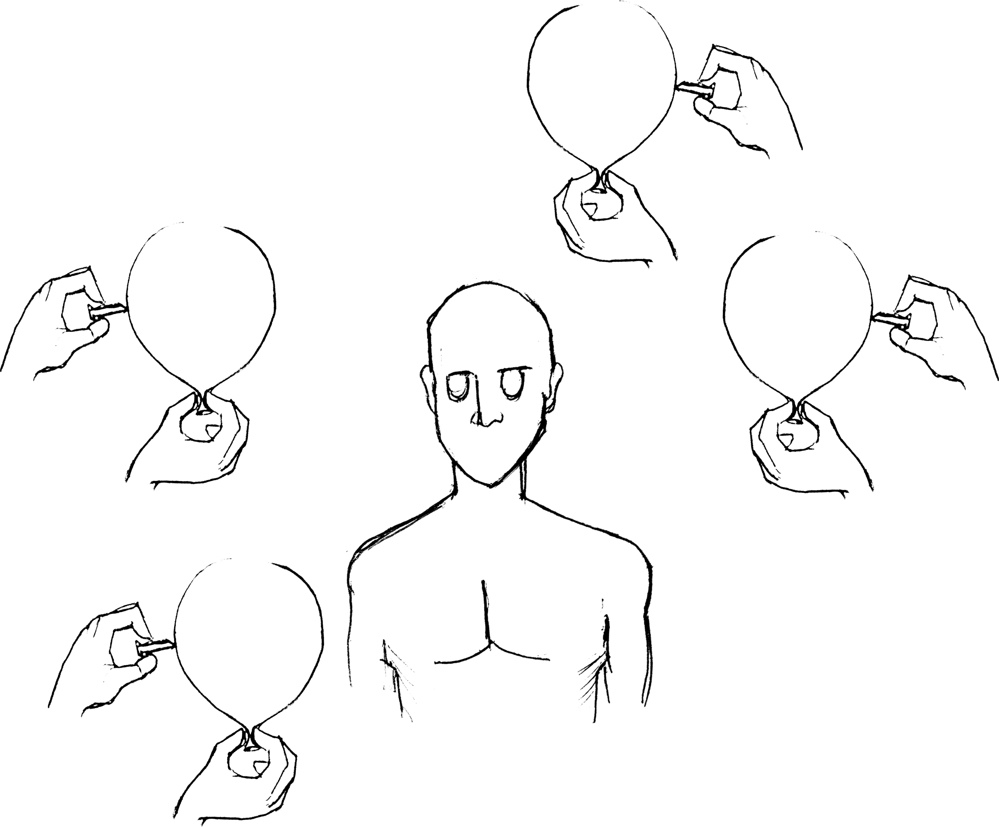
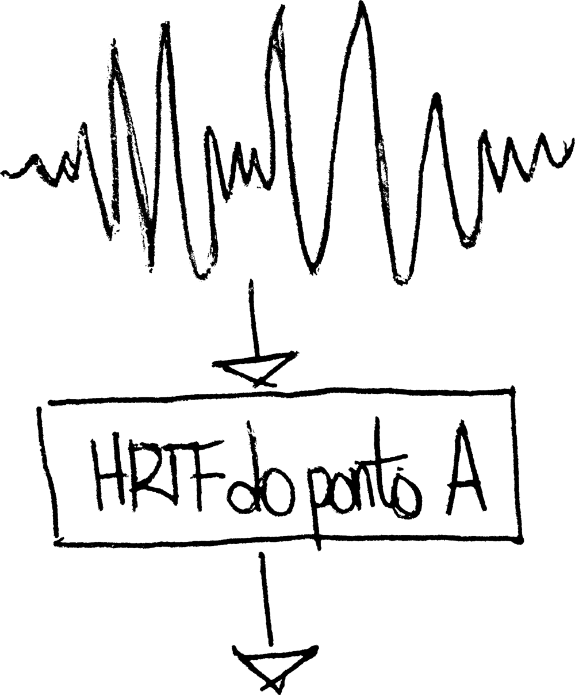

---?image=assets/img/bg/orange.jpg&size=cover

# @color[white](Imersão sonora)

---

## @css[text-pink](O corpo) 

é o centro do humano

---?image=assets/img/ceca.jpg&size=cover

---?image=assets/img/mestre-moa.jpg&size=cover

---

### Ressonância

---?image=assets/img/bg/blue.jpg&position=left&size=50% 100%

@snap[west split-screen-byline text-white]
Percepção do som
@snapend

@snap[east split-screen-img]

@snapend

---?image=assets/img/interior-da-coclea.jpg&size=cover

---

---

---?image=assets/img/bg/purple.jpg&size=cover

# @color[white](HRTF)

---

@snap[midpoint contain]

@snapend

---

---

---

@snap[midpoint contain]

@snapend

---

@snap[midpoint contain]

@snapend

---?image=assets/img/bg/pink.jpg&position=right&size=50% 100%

@snap[west span-45]
Diferença de fase interaural
@snapend

@snap[east span-50 text-white]
Diferença de intensidade interaural
@snapend
